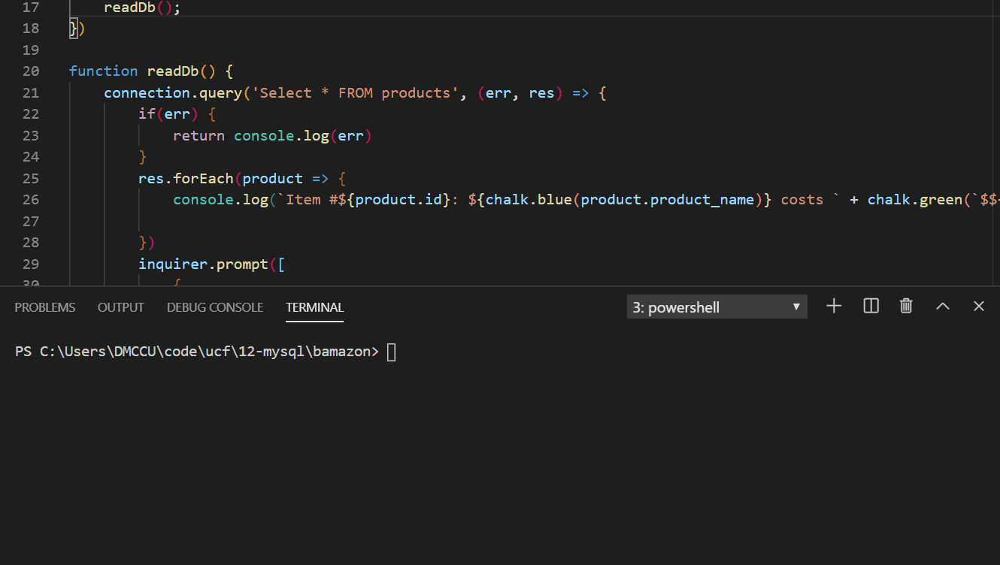

# bamazon

---------------------------
Purpose:
-Create a program that lets you purchase invintory from a store with stock in a SQL database.

----------------------------
Instructions:
-When you open the repo, download files, move to the root and run "npm install"
-Then run "npm run dev:customer", to run the customer interface.
-A list of items and their cost will appear.
-You will then be prompted to enter the item number of the product you want.
-Next, you will be prompted to enter the quantity you want to get.
-If that quantity is available, it will remove that quantity from the database and let you know the total price of your order.
-If that quantity isn't available, it will tell you insufficent quantity and leave the program.

----------------------------
Future Devlopment:
-Develop the manager and supervisor inputs.
-Use express to connect to the Browser to have a cleaner interface.

----------------------------
Tech Used:
-MySQL database
-Node js
-NPM js
-mysql, inquirer, and nodemon npm packages

----------------------------

